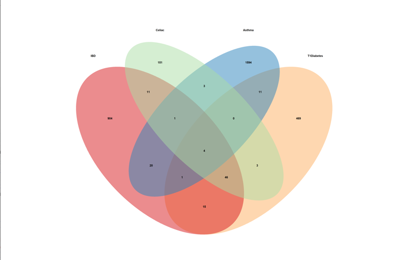

```{r setup, include=FALSE}
knitr::opts_chunk$set(echo = FALSE)
```

I needed to narrow down which genetic diseases I was looking at because there are just so many. To choose them, I pulled some of the most common autoimmune diseases from the top 15. I really only used the ones I had heard of before and came out with 8 diseases to look at other than asthma.

To start, I used SNP data from GWAS studies and began finding similarities between asthma and other autoimmune diseases specifically. For each dataset of diseases, I needed to extract the needed information. In this case, it was the allele difference and the gene that the SNP came from. Afterward, I could make a Venn diagram to visualize the SNP locations that were the same in different diseases.

```{r graphic, echo = FALSE, fig.cap= "Compare IBD, Graves, Celiac, Asthma", out.width='100%'}

```


Learn more about using Distill at <https://rstudio.github.io/distill>.


