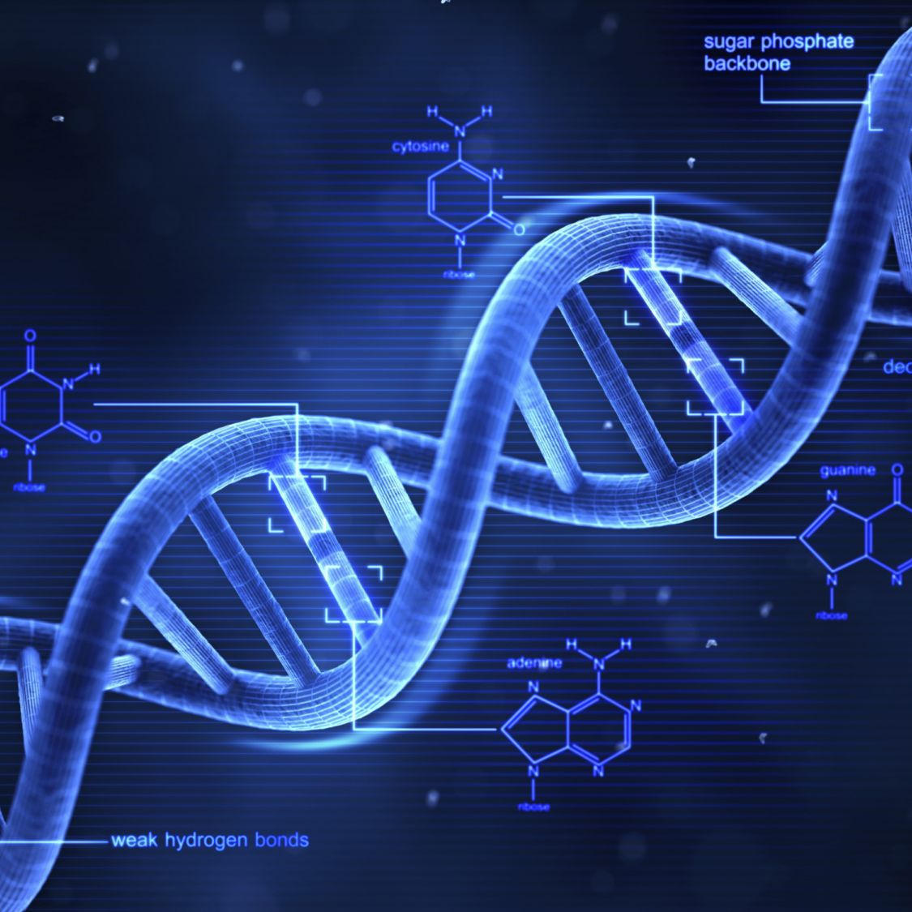

```{r setup, include=FALSE}
knitr::opts_chunk$set(echo = FALSE)

# Learn more about creating blogs with Distill at:
# https://rstudio.github.io/distill/blog.html

```


I am very excited to be working with genetic data to find diseases that are related to one another and how closely they may be related. Please feel free to browse around and see what I'm up to!

This project was worked on from September 2021 to December 2021 for a graduation project for BYU-Idaho.

```{r graphic, echo = FALSE, fig.cap = "", out.width ='100%'}

```
